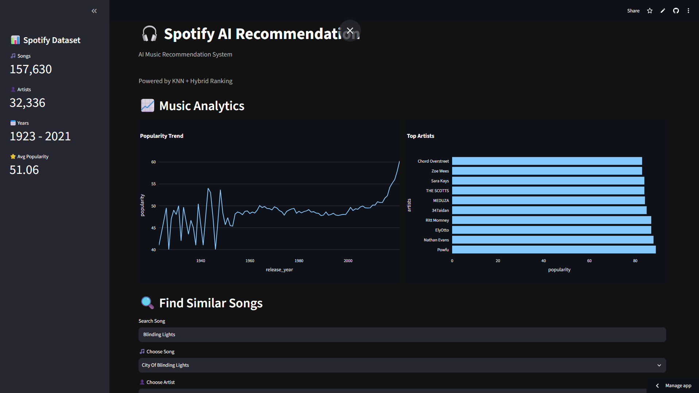
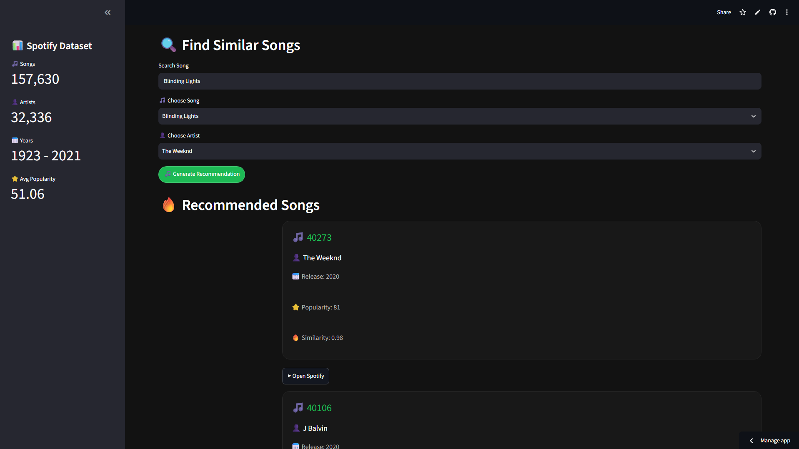

# 🎧 Spotify AI Recommendation System

  

### 🎵 AI-powered music recommendation platform
### Built with Machine Learning + Streamlit

---

# 🌟 Overview

Spotify AI Recommendation System is a machine learning project that recommends similar songs based on audio features.

The system analyzes:

- 🎧 Music characteristics
- 🤖 Similarity between songs
- 🔥 Popularity trends
- 👤 Artist preference

and generates personalized recommendations using a hybrid recommendation approach.

---

# 🚀 Live Demo

## 🌐 Application

https://spotify-data-analysis-fong.streamlit.app/

---

# 🎯 Project Goals

The objective of this project is to build a recommendation engine similar to modern streaming platforms.

Users can:

✅ Search songs  
✅ Select artists  
✅ Get AI-generated recommendations  
✅ Analyze music trends  
✅ Explore dataset insights  

---

# 🧠 Machine Learning Approach

## Recommendation Pipeline

Spotify Dataset

    ↓

Data Cleaning

    ↓

Feature Engineering

    ↓

Feature Scaling

    ↓

K-Nearest Neighbors Model

    ↓

Similarity Calculation

    ↓

Hybrid Ranking System

    ↓

Recommended Songs

---

# 🔥 Hybrid Recommendation Algorithm

The final recommendation score:

Hybrid Score =

Similarity Score × 70%

Artist Matching × 20%

Popularity Score × 10%

This approach improves recommendation quality by considering:

🎧 Sound similarity

+

👤 User artist preference

+

⭐ Song popularity

---

# 📊 Dashboard Features

## 🎵 Music Recommendation

Find songs with similar audio characteristics.

## 📈 Music Analytics

Interactive dashboard showing:

- Popularity trends
- Top artists
- Dataset statistics

## 🎨 Spotify Inspired UI

Designed with:

- Dark theme
- Spotify green color
- Recommendation cards
- Clean dashboard layout

---

# 🏗️ System Architecture

             User

              |

              v

    Streamlit Application

              |

              v

   Recommendation Engine

              |

              v

         KNN Model

              |

              v

      Spotify Dataset

---

# 🛠️ Tech Stack

## Programming Language

🐍 Python

## Data Processing

- Pandas
- NumPy

## Machine Learning

- Scikit-learn
- K-Nearest Neighbors

## Visualization

- Plotly

## Application

- Streamlit

## Deployment

- GitHub
- Streamlit Cloud

---

# 📂 Project Structure

spotify-data-analysis/

│
├── app.py

├── requirements.txt

├── README.md

│
├── notebooks/

│ ├── analysis.ipynb
│ ├── spotify_knn_model.pkl
│ ├── spotify_scaler.pkl
│ └── spotify_songs_clean.csv
│
└── screenshots/

---

# 📚 Dataset Features

| Feature | Description |
|---|---|
| Danceability | How suitable a song is for dancing |
| Energy | Intensity and activity |
| Loudness | Overall volume |
| Acousticness | Acoustic level |
| Instrumentalness | Instrumental probability |
| Valence | Musical mood |
| Tempo | Beats per minute |
| Popularity | Spotify popularity score |

---

# 📸 Screenshots

Coming soon:

screenshots/

├── dashboard.png

└── recommendation.png

---

# 🔮 Future Improvements

## Planned Features

- [ ] Spotify Web API Integration
- [ ] Real Spotify Search
- [ ] User Login System
- [ ] Personalized Playlist Generator
- [ ] Deep Learning Recommendation Model
- [ ] Real-time Recommendation Engine

---

# 📈 Learning Outcomes

Through this project I practiced:

✅ Data preprocessing

✅ Machine Learning workflow

✅ Recommendation systems

✅ Model deployment

✅ Building AI-powered applications

---

# 👨‍💻 Author

## Thawatchai Drakeao

GitHub:

https://github.com/ThawatchaiDrakeao

---

⭐ If you find this project interesting, consider giving it a star!

---

# 📸 Application Preview

## Dashboard

## Recommendation Engine

---

# 📸 Application Preview

## Dashboard

## Recommendation Engine

---

# 📸 Application Screenshots

## Dashboard

## Recommendation

